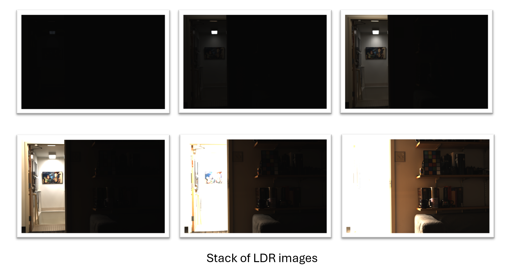
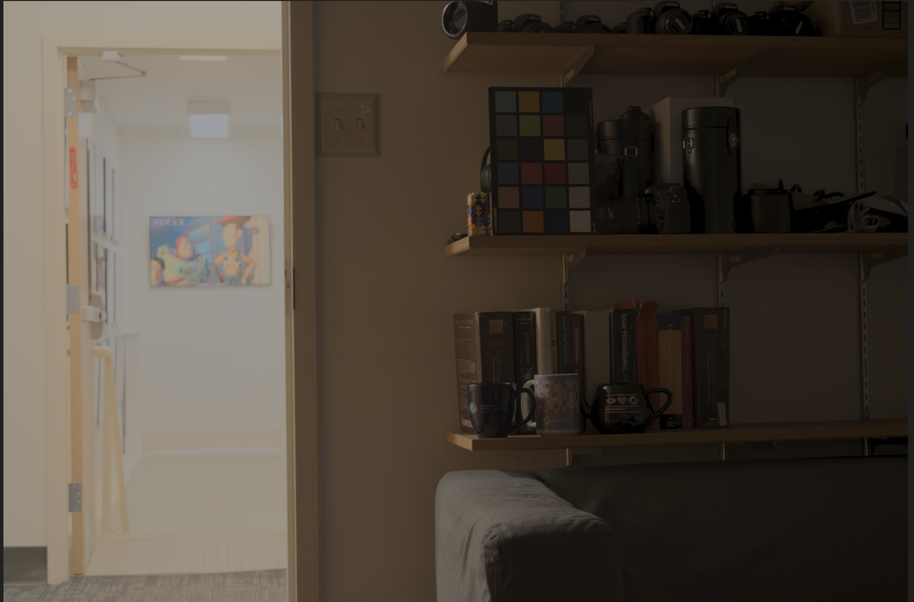
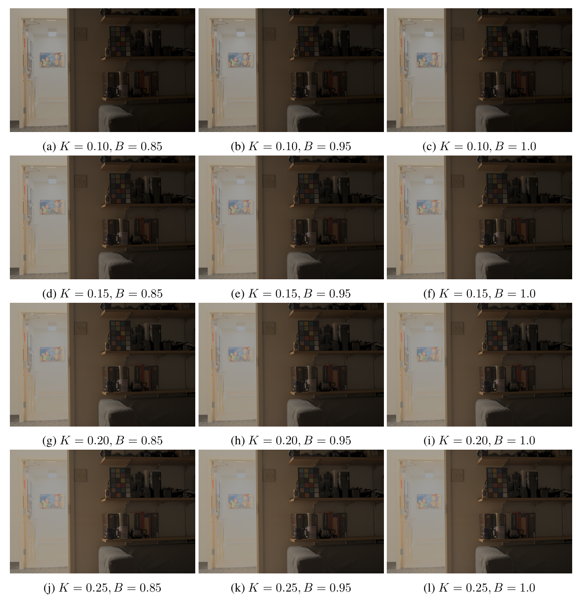

# 📸 High Dynamic Range (HDR) Imaging Pipeline (C++ / OpenCV)

This repository implements a complete **High Dynamic Range (HDR) imaging pipeline** in **C++ using OpenCV**. The system combines multiple Low Dynamic Range (LDR) images captured at different exposure times to reconstruct a single HDR image and then applies tone mapping to produce a displayable result.

This project is a C++ re-implementation of a classical HDR pipeline widely used in **computational photography and computer vision**.

---

## ✨ Features

- Supports **TIFF / PNG / JPG** LDR images  
- Multiple exposure HDR fusion  
- **Weighted radiance map reconstruction**
- **Reinhard tone mapping**
- Modular, clean C++ design
- Built using **OpenCV + CMake**
- Windows (MSVC + vcpkg) compatible

---

## 🧠 HDR Imaging Theory

Real-world scenes often exceed the dynamic range of standard cameras. HDR imaging overcomes this limitation by merging multiple exposures.

---

### 1️⃣ Radiance Map Reconstruction

Given LDR images \( I_i \) with exposure times \( \Delta t_i \), the HDR radiance map is computed as:

\[
E(x,y) = \frac{\sum_i w(I_i(x,y)) \cdot \frac{I_i(x,y)}{\Delta t_i}}
{\sum_i w(I_i(x,y))}
\]

Where:
- \( w(\cdot) \) is a weighting function
- \( I_i(x,y) \) is pixel intensity
- \( \Delta t_i \) is exposure time

---

### 2️⃣ Weighting Function

A triangular (hat-shaped) weighting function suppresses saturated pixels:

\[
w(z) =
\begin{cases}
z & z \leq 0.5 \\
1 - z & z > 0.5
\end{cases}
\]

---

### 3️⃣ Tone Mapping (Reinhard Operator)

To compress HDR values for display:

\[
L_{mapped} = \frac{L}{1 + L}
\]

---

## 🖼️ Results

### 🔹 Input LDR Images (Different Exposures)

---

### 🔹 HDR Radiance Map (Before Tone Mapping)

---

### 🔹 Final Tone-Mapped Output

---

=======
=======

# HDR-High-Dynamic-Range-_imaging
High Dynamic Range Imaging pipeline implemented in C++ using OpenCV
